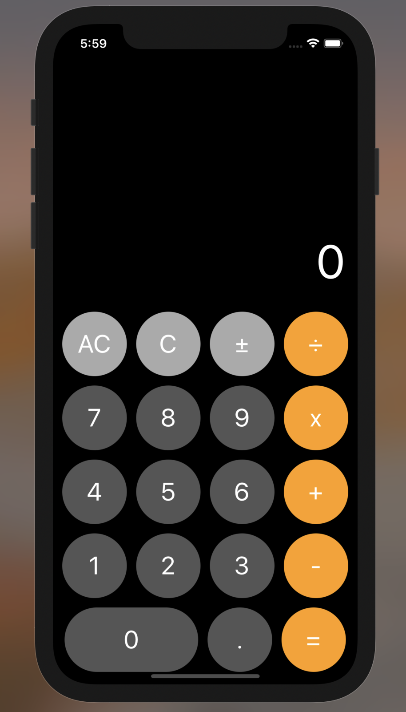

<h1>IOS Calculator   &nbsp; </h1>

---

This is a simple IOS Calculator made with SwiftUI.

#### Note
> This is not a total replica, of the IOS Calculator. Its a simpler version of it.

#### Preview

##### To clone this repository

> git clone https://github.com/reach-the-sky/IOS-Calculator.git

If you liked my project and appreciate the content I opensource, consider following me on github [🌥](https://github.com/reach-the-sky).

